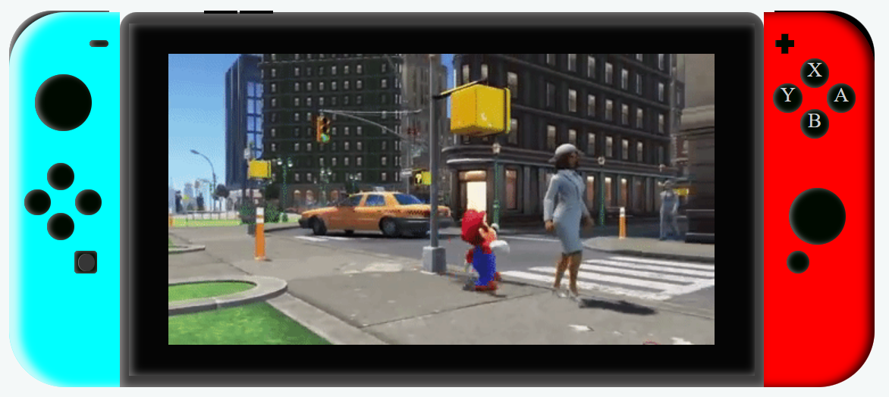

Hola

👋 Soy Àlex Moya.
💻 Estudiante de FullStack Developer en GeeksHubs Academy.

----------------------------------------------------

SOBRE EL PROYECTO:

Este proyecto consiste en reproducir la imagen frontal de una videoconsola🎮. En este caso, se trata de una Nintendo Switch:

He jugado con la luz para que refleje en su parte izquierda (joycon azul y pantalla) y se vea el sombreado en la parte derecha (joycon rojo).

También he agregado sombreado a los botones para que simulen textura gomosa y no queden tan planos.

Para este proyecto, he utilizado:

Puedes ver este proyecto en ⇥ [GitHub pages](https://github.com/Alexm0u/amc-geekshub-fsd-project1.git)

-----------------------------------------------------
Autor: Àlex Moya

Última vez editado: 22/01/2023
